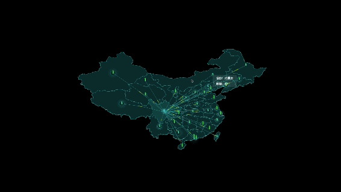

# 3D Map

# First 3D Web

## 1. Projektbeschreibung
Die 3D Interaktive Flugkarte ist ein dynamisches Visualisierungstool in Echtzeit, das für Großbildschirme entwickelt wurde und Flugrouten über China zeigt. Mit einer immersiven 3D-Karte ermöglicht das System den Benutzern, auf Flughäfen oder Orte zu klicken, um alle aktiven Flüge von diesem Punkt aus anzuzeigen. Die Flugrouten werden sanft über die Karte animiert und bieten eine klare und fesselnde Ansicht des Luftverkehrs. Dieses interaktive Tool eignet sich ideal für die Überwachung der Luftfahrt, Kontrollzentren oder öffentliche Informationsanzeigen und bietet eine benutzerfreundliche Erfahrung.

## 2. Projektfunktionsschnittstelle

  

  Beschreibung: Voll funktionsfähige Schnittstelle zum Ausführen der endgültigen Version des Projekts

## 3. Technische Auswahl
