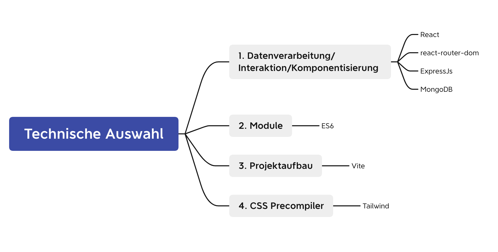
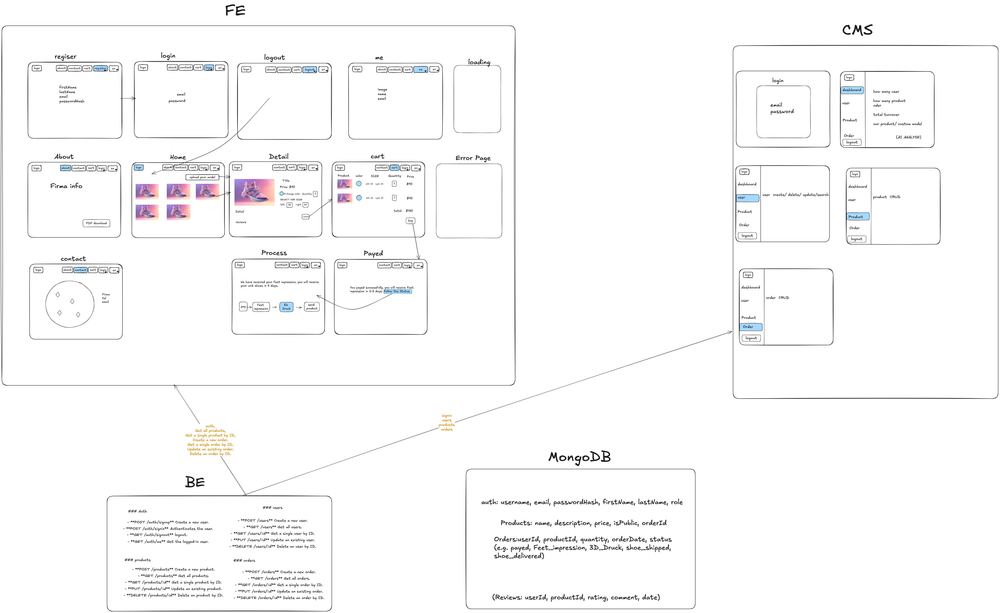
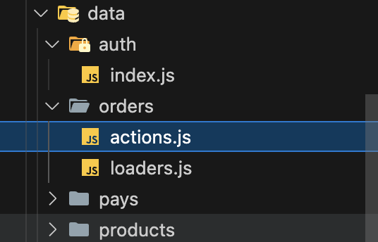

# Beschreibung

## 1. Projektbeschreibung

PrintMyStride ist ein Full-Stack-Projekt, das in zwei Wochen entwickelt wurde. Es bietet maßgeschneidertes Schuhwerk an, das mithilfe von 3D-Drucktechnologie auf die einzigartige Fußform jedes Kunden zugeschnitten ist. Kunden erhalten nach dem Kauf einen Fußabdruck, der zur Herstellung ihrer personalisierten Schuhe verwendet wird. Das Backend wurde mit Express und das Frontend mit React erstellt.

PrintMyStride CMS richtet sich an die Mitarbeiter und ermöglicht das effiziente Verwalten der Geschäftsprozesse. Es unterstützt die Erstellung, Anzeige, Aktualisierung und Löschung (CRUD) von Produkt-, Bestell- und Kundendaten und analysiert außerdem die Interaktionen zwischen Kunden und Geschäft.

## 2. Projektfunktionsschnittstelle


Beschreibung: Voll funktionsfähige Schnittstelle zum Ausführen der endgültigen Version des Projekts

## 3. Technische Auswahl



## 4. Architektur der E-Commerce-Plattform



## 5. Performance

1. Verwendung von React.memo

```react
import { memo } from "react";
const Demo = memo(()=>{});
```

2.  Verwendung von lazy, Suspense

```
import { lazy, Suspense } from "react";

const About = lazy(() => import("@/pages/About.jsx"));

<Suspense fallback={<Loading />}>
    <About />
</Suspense>
```

## 6. Routes

```App.js
import { createBrowserRouter, RouterProvider } from "react-router-dom";
import { lazy, Suspense, memo } from "react";

import { getAllProducts, getOneProduct } from "@/data/products/loaders.js";
import { getAllOrders, getOneOrder } from "@/data/orders/loaders.js";
import { RootLayout, ProtectLayout } from "@/layout";
import Loading from "@/components/Loading.jsx";

const Cart = lazy(() => import("@/pages/Cart.jsx"));
const Detail = lazy(() => import("@/pages/Detail.jsx"));
const ErrorPage = lazy(() => import("@/pages/ErrorPage.jsx"));
const Home = lazy(() => import("@/pages/Home.jsx"));
const Login = lazy(() => import("@/pages/Login.jsx"));
const Register = lazy(() => import("@/pages/Register.jsx"));
const Order = lazy(() => import("@/pages/Order.jsx"));
const Orders = lazy(() => import("@/pages/Orders.jsx"));

const App = memo(() =>{
  const router = createBrowserRouter([
    {
      path: "/",
      element: <RootLayout />,
      loader: getAllProducts,
      children: [
        {
          index: true,
          element: (
            <Suspense fallback={<Loading />}>
              <Home />
            </Suspense>
          ),
          loader: getAllProducts,
        },
        {
          path: "/products/:id",
          element: (
            <Suspense fallback={<Loading />}>
              <Detail />
            </Suspense>
          ),
          loader: ({ params }) => {
            return getOneProduct(params.id);
          },
        },
        {
          path: "/login",
          element: (
            <Suspense fallback={<Loading />}>
              <Login />
            </Suspense>
          ),
        },
        {
          path: "/register",
          element: (
            <Suspense fallback={<Loading />}>
              <Register />
            </Suspense>
          ),
        },
        {
          index: "",
          element: (
            <Suspense fallback={<Loading />}>
              <ProtectLayout />
            </Suspense>
          ),
          children: [
            {
              path: "/orders/user/:userId",
              element: (
                <Suspense fallback={<Loading />}>
                  <Orders />
                </Suspense>
              ),
              loader: ({ params }) => {
                return getAllOrders(params.userId);
              },
            },
            {
              path: "/orders/:id",
              element: (
                <Suspense fallback={<Loading />}>
                  <Order />
                </Suspense>
              ),
              loader: ({ params }) => {
                return getOneOrder(params.id);
              },
            },
          ],
        },
      ],
      errorElement: (
        <Suspense fallback={<Loading />}>
          <ErrorPage />
        </Suspense>
      ),
    },
  ]);
  return <RouterProvider router={router} />;
})
export default App;
```

## 7. fetchData


<br />
.env

```
VITE_BASE_URL = http://localhost:8080
```

loaders.js

```
const API_URL = import.meta.env.VITE_BASE_URL  || 'http://localhost:8080';
export const getAllOrders = async (userId) => {
  const res = await fetch(`${API_URL}/orders?userId=${userId}`);
  if (res.status !== 200) throw Error("something went wrong");
  const data = await res.json();
  return data;
};
export const getOneOrder = async (id) => {
  const res = await fetch(`${API_URL}/orders/${id}`);
  if (res.status !== 200) throw Error("something went wrong");
  const data = await res.json();
  return data;
};
```

actions.js

```
import { redirect } from "react-router-dom";
import { showToast } from "@/utils/index";

const API_URL = import.meta.env.VITE_BASE_URL  || 'http://localhost:8080';
export const createOrder = async ({ request }) => {
  const formData = Object.fromEntries(await request.formData());
  const res = await fetch(`${API_URL}/orders`, {
    method: "POST",
    headers: {
      "content-type": "application/json",
    },
    credentials: "include",
    body: JSON.stringify(formData),
  });
  showToast(res, "create failed!", "create success!");
  return redirect("/orders");
};

export const updateOrder = async ({ params, request}) => {
  const id = params.id;
  const formData = Object.fromEntries(await request.formData());

  if (formData.products) {
    formData.products = JSON.parse(formData.products).map(product => {
      const { _id, ...rest } = product;
      return {
        ...rest,
        productId: product.productId._id
      };
    });
  }
  const res = await fetch(`${API_URL}/orders/${id}`, {
    method: "PUT",

    credentials: "include",
    headers: {
      'Content-Type': 'application/json',
    },
    body: JSON.stringify(formData),
  });

  showToast(res, "Update failed!", "Update success!");
  return redirect("/orders");
};

export const deleteOrder = async ({ params }) => {
  const id = params.id;
  const res = await fetch(`${API_URL}/orders/${id}`, {
    method: "DELETE",
    headers: {
      "Content-Type": "application/json",
    },
    credentials: "include",
  });
  showToast(res, "Delete failed!", "Delete success!");
  return redirect("/orders");
};
```

utils.js

```
import { toast } from "react-toastify"; // Assuming you're using react-toastify
import { useEffect } from "react";

export const useToaster = () => {
  const handleEvent = (e) => {
    const { msg, status } = e.detail;
    if (status === "success") {
      toast(msg);
    } else {
      toast.error(msg);
    }
  };

  useEffect(() => {
    document.addEventListener("myToaster", handleEvent);
    return () => document.removeEventListener("myToaster", handleEvent);
  }, []);
};

export const showToast = (res, errorMsg, successMsg) => {
  if (!res.ok) {
    const event = new CustomEvent("myToaster", {
      detail: { status: "error", msg: errorMsg },
    });
    document.dispatchEvent(event);
  } else {
    const event = new CustomEvent("myToaster", {
      detail: { status: "success", msg: successMsg },
    });
    document.dispatchEvent(event);
  }
};

export const formatCurrency = (amount) =>
  new Intl.NumberFormat("en-US", {
    style: "currency",
    currency: "USD",
  }).format(amount);

export const formatDate = (dateString) => {
  const date = new Date(dateString);
  return new Intl.DateTimeFormat("en-CA", {
    year: "numeric",
    month: "2-digit",
    day: "2-digit",
  }).format(date);
};

export const flattenObject = (obj, parent = '', res = {}) => {
  for (let key in obj) {
      if (typeof obj[key] === 'object' && !Array.isArray(obj[key]) && obj[key] !== null) {
          flattenObject(obj[key], parent + key + '.', res);
      } else if (Array.isArray(obj[key])) {
          obj[key].forEach((item, index) => {
              flattenObject(item, parent + key + '[' + index + '].', res);
          });
      } else {
          res[parent + key] = obj[key];
      }
  }
  return res;
}
```

## 8. UI/UX

font
```
npm i @fontsource/redressed
npm i @fontsource/roboto
```

tailwind, Theme und DaisyUI
```
npm install -D tailwindcss postcss autoprefixer
npx tailwindcss init -p
npm i -D daisyui@latest
npm i react-icons react-toastify chart.js react-chartkick

```

tailwind.config.js
```
/** @type {import('tailwindcss').Config} */
import daisyui from "daisyui";
import * as themes from "daisyui/src/theming/themes";
export default {
  content: ["./index.html", "./src/**/*.{js,ts,jsx,tsx}"],
  theme: {
    extend: {
      backgroundImage: {
        "gradient-blue":
          "linear-gradient(to right, color(a98-rgb 0.24 0.3 0.98),rgb(34 30 191), rgb(4 15 117))",
        "gradient-lisa":
          "linear-gradient(to right,  rgb(46 76 238), rgb(118 58 245), rgb(166 4 242))",
        "gradient-green": "linear-gradient(135deg, #00739C, #81B0B2, #016D48)",
        "gradient-pink": "linear-gradient(135deg, #F49C80, #81B0B2, #F49C80)",
      },
    },
    fontFamily: {
      sans: ["Roboto", "ui-sans-serif", "system-ui"],
      redressed: ["Redressed", "cursive"],
    },
  },
  plugins: [require("daisyui")],
  daisyui: {
    themes: [
      {
        dark: {
          ...themes.dark,
          primary: "#334cff",
          secondary: "#EFB51F",
          neutral: "#1D232A",
          "base-content": "white",
        },
        light: {
          ...themes.light,
          primary: "#040F75",
          secondary: "#0BBAB5",
          neutral: "#E6F0ED",
          "base-content": "#016D48",
        },
      },
    ],
  },
};

```

theme
```
  const [theme, setTheme] = useState(localStorage.getItem("theme") || "dark");
  useEffect(() => {
    localStorage.setItem("theme", theme);
    const localTheme = localStorage.getItem("theme");
    document.querySelector("html").setAttribute("data-theme", localTheme);
  }, [theme]);
  const handleToggle = () => {
    setTheme(theme === "dark" ? "light" : "dark");
  };
```

```
<input
    type="checkbox"
    className="theme-controller"
    value="synthwave"
    onClick={handleToggle}
/>
```

index.css
```
@import "@fontsource/redressed";
@import "@fontsource/roboto";

@tailwind base;
@tailwind components;
@tailwind utilities;

.btn-gradient-blue {
  @apply bg-gradient-blue hover:bg-gradient-lisa text-white rounded-xl text-center py-1;
}

.btn-gradient-green {
  @apply bg-gradient-green hover:bg-gradient-pink text-white rounded-3xl text-center py-1;
}

```

## 9. alias
vite.config.js
```
import { defineConfig } from "vite";
import react from "@vitejs/plugin-react";
import { dirname, resolve } from "path";
import { fileURLToPath } from "url";

const __dirname = dirname(fileURLToPath(import.meta.url));

export default defineConfig({
  resolve: {
    alias: {
      "@": resolve(__dirname, "src"),
    },
  },
  plugins: [react()],
});
```
