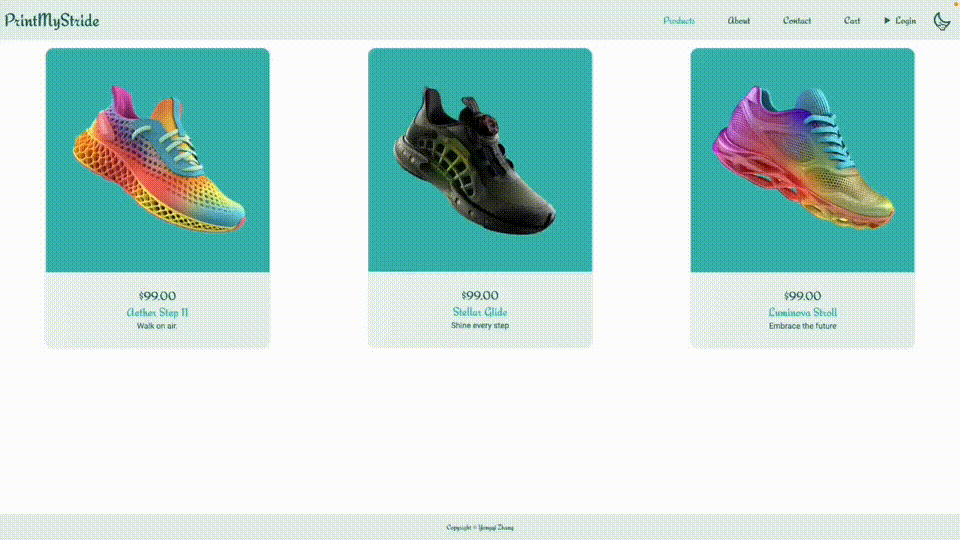
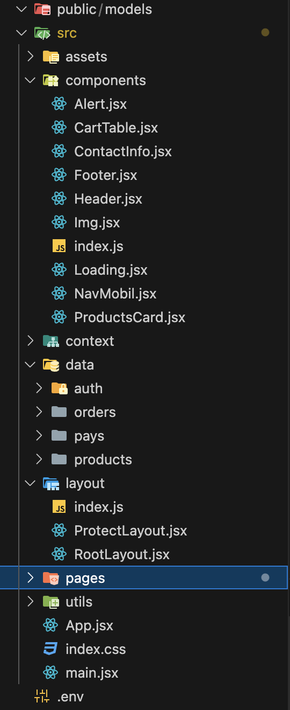

# Frontend

## 1. Projektbeschreibung

Dieses Projekt ist eine innovative E-Commerce-Webanwendung namens PrintMyStride, die maßgeschneiderte Schuhe mittels 3D-Drucktechnologie anbietet. Das Geschäft ermöglicht es den Kunden, personalisierte Schuhe zu erwerben, die auf der individuellen Fußform basieren. Nach dem Kauf erhalten die Kunden einen Abdruck ihres Fußes, welcher anschließend zur Erstellung der maßgeschneiderten Schuhe durch fortschrittliche 3D-Drucktechnologie verwendet wird. [zur Website](https://fe-printmystride.onrender.com/)

1. Die Webseite enthält wesentliche Funktionen wie eine Startseite, Produktdetails, Lieferungsdetails, einen Warenkorb sowie die Registrierung und den Login für Benutzer.

2. Verwenden Sie die neuesten und heißesten Front-End-Technologien wie React, Tailwind Route Lazy Loading u.s.w.

## 2.Projektfunktionsschnittstelle

Beschreibung: Voll funktionsfähige Schnittstelle zum Ausführen der endgültigen Version des Projekts

## 3.Struktur

