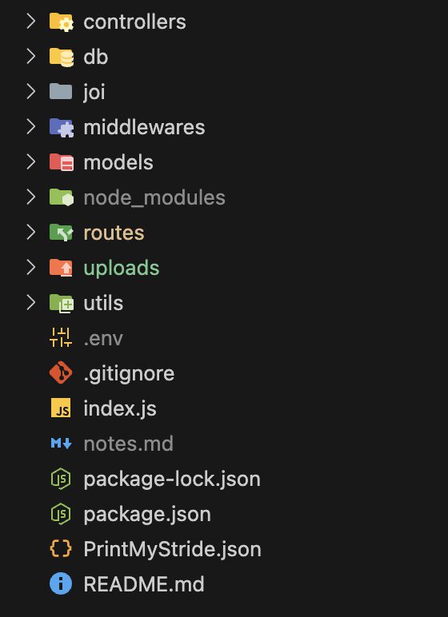

# Backend

## 1. Projektbeschreibung

Dieses Projekt ist ein Node.js Express API-Server, der zur Verwaltung von Produkten, Benutzern und Bestellungen entwickelt wurde.

## 2.Struktur




## 3. Code
.env
```
MONGO_URI = mongodb+srv://test

PORT = 8080

SPA_ORIGIN1 = "http://localhost:5173" 
SPA_ORIGIN2 =  "http://localhost:5174"
# SPA_ORIGIN1 = "https://fe-printmystride.onrender.com/" 
# SPA_ORIGIN2 =  "https://cms-printmystride.onrender.com/"

JWT_SECRET = test

CLOUDINARY_URL=cloudinary://test

CLOUDINSRY_API_SECRET="test"

CLOUDINSRY_API_KEY="test91924198231"

CLOUDINSRY_CLOUD_NAME=test


# OPEN_AI_APIKEY= test

```

controllers/order.js
```
import { isValidObjectId } from "mongoose";
import Order from "../models/Order.js";
import asyncHandler from "../utils/asyncHandler.js";
import ErrorResponse from "../utils/ErrorResponse.js";

export const getAllOrders = asyncHandler(async (req, res, next) => {
  const { userId } = req.query;
  let orders;
  if (userId) {
    orders = await Order.find({ userId })
      .populate({ path: "userId", strictPopulate: false })
      .populate({
        path: "products",
        populate: {
          path: "productId",
        },
        strictPopulate: false,
      });
    return res.json(orders);
  }

  orders = await Order.find()
    .populate({ path: "userId", strictPopulate: false })
    .populate({
      path: "products",
      populate: {
        path: "productId",
      },
      strictPopulate: false,
    });
  res.json(orders);
});

export const createOrder = asyncHandler(async function (req, res, next) {
  const newOrder = new Order(req.body);
  await newOrder.save();
  res.status(201).json({ newOrder });
});

export const getSingleOrder = asyncHandler(async (req, res, next) => {
  const {
    params: { id },
  } = req;
  if (!isValidObjectId(id)) throw new ErrorResponse("Invalid id", 400);
  const order = await Order.findById(id)
    .populate({ path: "userId", strictPopulate: false })
    .populate({
      path: "products",
      populate: {
        path: "productId",
      },
      strictPopulate: false,
    });
  if (!order)
    throw new ErrorResponse(`Order with id of ${id} doesn't exist`, 404);
  res.send(order);
});

export const updateOrder = asyncHandler(async (req, res, next) => {
  const {
    body,
    params: { id },
  } = req;
  if (!isValidObjectId(id)) throw new ErrorResponse("Invalid id", 400);
  const updatedOrder = await Order.findByIdAndUpdate(id, body, { new: true })
    .populate({ path: "userId", strictPopulate: false })
    .populate({
      path: "products",
      populate: {
        path: "productId",
      },
      strictPopulate: false,
    });
  if (!updatedOrder)
    throw new ErrorResponse(`Order with id of ${id} doesn't exist`, 404);
  res.json(updatedOrder);
});

export const deleteOrder = asyncHandler(async (req, res, next) => {
  const {
    params: { id },
  } = req;
  if (!isValidObjectId(id)) throw new ErrorResponse("Invalid id", 400);
  const deletedOrder = await Order.findByIdAndDelete(id)
    .populate({ path: "userId", strictPopulate: false })
    .populate({
      path: "products",
      populate: {
        path: "productId",
      },
      strictPopulate: false,
    });
  if (!deletedOrder) throw new Error(`Order with id of ${id} doesn't exist`);
  res.json({ success: `Order with id of ${id} was deleted` });
});

```
db/index.js
```
import mongoose from "mongoose"

const dbInit = async ()=>{
    try {
       const conn = await mongoose.connect(process.env.MONGO_URI, {dbName: 'CustomShoeStore'})
        console.log(`Connected to MongoDB: ${conn.connection.name}`);
    } catch (error) {
        console.log(error);
        process.exit()
    }
}

export default dbInit

```
joi/schemas.js
```
import Joi from "joi";

export const userSchema = Joi.object({
  userName: Joi.string().optional(),
  email: Joi.string().required(),
  password: Joi.string().alphanum().min(8).max(12).required(),
  role: Joi.string().optional(),
});

export const signinSchema = Joi.object({
  email: Joi.string().required(),
  password: Joi.string().alphanum().min(8).max(12).required(),
});

export const productSchema = Joi.object({
  title: Joi.string().required(),
  image: Joi.string().uri().optional(),
  description: Joi.string().required(),
  summary: Joi.string().required(),
  price: Joi.string().required(),
  isPublic: Joi.boolean().required(),
  userId: Joi.string().required(),
});

const orderProductSchema = Joi.object({
  productId: Joi.string().required(), 
  quantity: Joi.number().integer().min(1).required(), 
});

export const orderSchema = Joi.object({
  orderDate: Joi.date().iso().optional(),
  status: Joi.string()
    .valid(
      "payed",
      "feet_impression",
      "3D_Druck",
      "shoe_shipped",
      "shoe_delivered"
    )
    .required(),
  userId: Joi.string().required(),
  products: Joi.array().items(orderProductSchema).min(1).required(),
});

export const reviewSchema = Joi.object({
  userId: Joi.string().required(),
  productId: Joi.string().required(),
  rating: Joi.string().required(),
  comment: Joi.string().required(),
  reviewDate: Joi.date().iso().optional(),
});


export const paymentSchema = Joi.object({
  orderId: Joi.string().required(), // Assuming you are linking this payment to an order
  name: Joi.string().required(),
  address: Joi.string().required(),
  city: Joi.string().required(),
  state: Joi.string().required(),
  zip: Joi.string().required(),
  country: Joi.string().required(),
  cardNumber: Joi.string().required(), // Validate card number format
  expiryDate: Joi.string().pattern(/^\d{2}\/\d{2}$/).required(), // Validate MM/YY format
  cvv: Joi.string().length(3).pattern(/^[0-9]+$/).required(), // Validate 3-digit CVV
});
```
models/Order.js
```
import mongoose from "mongoose";
const { Schema, model, ObjectId } = mongoose;

const orderSchema = new Schema({
  orderDate: {
    type: Date,
    default: Date.now,
  },
  status: {
    type: String,
    enum: [
      "ordered",
      "payed",
      "feet_impression",
      "3D_Druck",
      "shoe_shipped",
      "shoe_delivered",
    ],
    required: true,
  },
  userId: {
    type: Schema.Types.ObjectId,
    ref: "User",
    required: true,
  },

  products: [
    {
      productId: {
        type: Schema.Types.ObjectId,
        ref: "Product",
        required: true,
      },
      quantity: {
        type: Number,
        required: true,
        min: 1,
      },
    }
  ],
});

export default model("Order", orderSchema);

```
routes/productsRouter.js
```
import { Router } from "express";
import validateJOI from "../middlewares/validateJOI.js";
import verifyToken from "../middlewares/verifyToken.js";
import upload from "../middlewares/multer.js";
import cloudinary from "../utils/cloudinary.js";
import {
  createProduct,
  deleteProduct,
  getAllProducts,
  getSingleProduct,
  updateProduct,
} from "../controllers/product.js";
import { productSchema } from "../joi/schemas.js";
import fs from "fs";
import path from "path";

const uploadDir = path.join(process.cwd(), "uploads");
if (!fs.existsSync(uploadDir)) {
  fs.mkdirSync(uploadDir, { recursive: true });
}

const productsRouter = Router();

productsRouter
  .route("/")
  .get(getAllProducts)
  .post(
    verifyToken,
    upload.single("image"),
    function (req, res, next) {
      cloudinary.uploader.upload(req.file.path, function (error, result) {
        if (error) {
          return res
            .status(400)
            .json({ success: false, message: error.message });
        } else {
          req.body.image = result.url;
          next();
        }
      });
    },
    validateJOI(productSchema),
    createProduct
  );

productsRouter
  .route("/:id")
  .get(getSingleProduct)
  .put(
    verifyToken,
    upload.single("image"),
    async function (req, res, next) {
      if (req.file) {
        // If there's a file, upload it to Cloudinary
        try {
          const result = await cloudinary.uploader.upload(req.file.path);
          req.body.image = req.body.image = result.url;
        } catch (error) {
          return res
            .status(400)
            .json({ success: false, message: error.message });
        }
      }
      next();
    },
    validateJOI(productSchema),
    updateProduct
  )
  .delete(verifyToken, deleteProduct);

export default productsRouter;

```

utils/asyncHandler.js
```
const asyncHandler = fn => (req, res, next) => Promise.resolve(fn(req, res, next)).catch(next);

export default asyncHandler;

```
utils/cloudinary.js
```
import { v2 as cloudinary } from "cloudinary";

cloudinary.config({
  cloud_name: process.env.CLOUDINSRY_CLOUD_NAME,
  api_key: process.env.CLOUDINSRY_API_KEY,
  api_secret: process.env.CLOUDINSRY_API_SECRET,
});

const url = cloudinary.url("sample.jpg", {
  transformation: [
    { fetch_format: "auto"},
    { quality: "auto" },
  ],
}); 

(async () => {
  try {
    const result = await cloudinary.uploader.upload("./uploads/ee495e40ace39e3a407b516c946ed8ff", {
      upload_preset: "preset1",
    });
    const url = cloudinary.url(result.public_id, {
      transformation: [
        { fetch_format: "auto",  quality: "auto"},
        { width: 400, height: 400, crop: "fill", gravity: "auto" },
      ],
    });
  } catch (error) {
    console.error(error);
  }
})
export default cloudinary;
```
utils/ErrorResponse.js
```
class ErrorResponse extends Error {
  constructor(message, statusCode) {
    super(message);
    this.statusCode = statusCode;
  }
}

export default ErrorResponse;

```
middlewares/errorHandler.js
```
const errorHandler = (err, req, res, next) => {
  console.error(err.stack);
  res.status(err.statusCode || 500).json({ error: err.message });
};

export default errorHandler;
```
middlewares/multer.js
```
import path from 'path'
import multer from 'multer'
const storage = multer.diskStorage({
  destination: function (req, file, cb) {
    cb(null, 'uploads')
  },
  filename: function (req, file, cb) {
    let extname = path.extname(file.originalname);
   
    cb(null, file.fieldname + '-' + Date.now()  + extname);
 }
})

const upload = multer({ storage: storage })

export default upload;
```

middlewares/validateJOI.js
```
import ErrorResponse from '../utils/ErrorResponse.js';

const validateJOI = schema => (req, res, next) => {
  const { error } = schema.validate(req.body);
  return error ? next(new ErrorResponse(error.message, 400)) : next();
};

export default validateJOI;
```
middlewares/verifyToken.js
```
import jwt from "jsonwebtoken";
import asyncHandler from "../utils/asyncHandler.js";

const verifyToken = asyncHandler(async (req, res, next) => {
  const cookies =
    req.headers.cookie?.split(";").map((cookie) => cookie.trim()) || [];
  const cookiesObj = cookies.reduce((acc, cookie) => {
    const [key, value] = cookie.split("=");
    acc[key] = value;
    return acc;
  }, {});
  const token = cookiesObj.token;
  if (!token)
    return res.status(401).json({ error: "Unauthorized. Please sign in" });
  const decoded = jwt.verify(token, process.env.JWT_SECRET);
  req.userId = decoded.id;
  next();
});

export default verifyToken;

```
