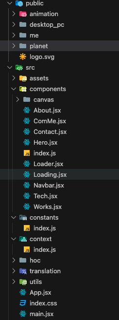

# Beschreibung

## 1. Projektbeschreibung
Die Website ist eine 3D-Portfolio-Seite mit einem 3D-Avatar von mir und 3D-Icons, die meine Fähigkeiten darstellen. Beim Scrollen bewegt sich der Avatar dynamisch mit. Die Seite wurde mit React, Tailwind CSS und Three.js entwickelt und hebt interaktive, visuelle Elemente sowie Webentwicklungskompetenzen hervor. [zur Website](https://zhang-yongqi.onrender.com/)

## 2. Projektfunktionsschnittstelle

  

## 3. Struktur
 